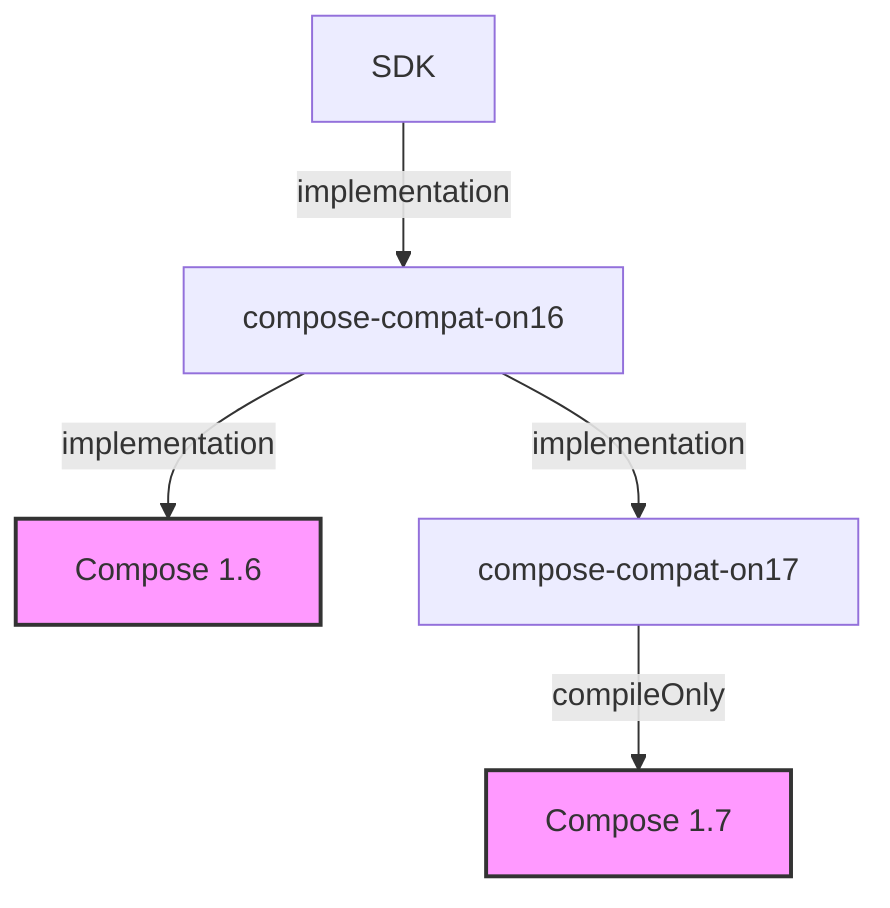

# Unbreaking the changes in Compose 1.7

Compose 1.7 brings a few improvements, most notably performance benefits. Updating seems like a no-brainer - but unfortunately it's not always that easy!

## Updating to Compose 1.7: Who moves first?

Say we're working on an internal SDK integrated into various apps. Updating to Compose 1.7 poses an interesting challenge: Who moves first?

In the beginning I believed it doesn't matter. After opening our `libs.versions.toml` and bumping Compose to 1.7... we see build errors?
It turns out that even though Compose 1.7 technically is only a minor version bump, in practice this is not necessarily the case.
In particular, this internal SDK uses many APIs that are marked as experimental in Compose 1.6.
Google grants itself the liberty to change these APIs as they evolve. Unfortunately they do so without a deprecation cycle.
This includes innocuous-looking APIs like `ModalBottomSheet`. It used to have a parameter `windowInsets: WindowInsets` that has changed to `contentWindowInsets: @Composable () -> WindowInsets` - a breaking change.

### Idea 1: The SDKs update first

This is a problem. Let's assume both the internal SDK as well as the host app use the `ModalBottomSheet` component.
If the internal SDK updates to Compose 1.7 first, this causes a transitive dependency for the host app to Compose 1.7 as well.
As the app is still using the Compose 1.6-version of `ModalBottomSheet`, the app's call to this composable is now broken, forcing
the app's development team to immediately work on restoring Compose 1.7 compatibility. As an SDK developer, this is not a situation I want to put an app developer in.

### Idea 2: Wait for the host apps to update

Unfortunately we also can't just wait for the host app to upgrade to Compose 1.7. As there can only be a single Compose version on the classpath,
the moment the app depends on Compose 1.7, our SDKs would cause runtime crashes as they are trying to call Compose 1.6-APIs that are no longer available
or changed in Compose 1.7.

Using a naive approach, all internal and external modules using experimental Compose APIs of an app have to move to Compose 1.7 at the same time.
In many organizations, this is not desirable.

## The way out

Not updating is not an option - so how can we escape from this trap?

As an Android dev, the solution is actually right before our eyes. For calling Android framework APIs, the
Android SDK itself offers a way to call different APIs depending on the system version the app is running on. Code like the following is a frequent sight:

```kotlin
 val color = if (Build.VERSION.SDK_INT >= Build.VERSION_CODES.M) {
    resources.getColor(R.color.colorPrimary, null)
} else {
    resources.getColor(R.color.colorPrimary)
}
```

What if we could do the same for Compose APIs?

The solution is a compatibility layer that calls Compose 1.6 APIs when Compose 1.6 is on the classpath
and Compose 1.7 APIs when Compose 1.7 is on the classpath. Let's get started:

```kotlin
@Composable
fun ModalBottomSheetCompat(
    contentWindowInsets: @Composable () -> WindowInsets = { BottomSheetDefaults.windowInsets },
    // ...
) {
    if (runningOnCompose16) {
        androidx.compose.material3.ModalBottomSheet(
            windowInsets = contentWindowInsets(),
            // ...
        )
    } else {
        // We're on Compose 1.7 or higher
        androidx.compose.material3.ModalBottomSheet(
            contentWindowInsets = contentWindowInsets,
            // ...
        )
    }
}
```

Maybe you've already noticed: This snippet can't actually be compiled. To not force the app to Compose 1.7 through a transitive dependency,
the internal SDK has to declare a dependency to Compose 1.6. However, Compose 1.6 does not have an overload of
`ModalBottomSheet` with a `contentWindowInsets` parameter, so the function call cannot be resolved by the compiler.

### Setting up the Gradle module structure for our Compose Compatibility Layer

Remember, the goal is to build a compatibility layer offering an API callable from Compose 1.6 *and* Compose 1.7 environments. This requires two Gradle modules: `compose-compat-on16` and `compose-compat-on17`.



The `compose-compat-on16` module defines the API of our compatibility layer. To keep the structure simple,
it also has an `implementation` dependency to Compose 1.6 and calls its APIs directly within a Compose 1.6 environment.

When `compose-compat-on16` detects that it's running within a Compose 1.7 environment, it delegates to the `compose-compat-on17` module.
To call Compose 1.7 APIs (without resorting to Reflection), it must depend on Compose 1.7.
This has to be a `compileOnly` dependency, ensuring that no transitive dependency to Compose 1.7 exists for the host app.

Let's take a look at the code.

#### `compose-compat-on16`

**build.gradle.kts**
```kotlin
plugins {
    // ...
}

android {
    // ...
}

dependencies {
    implementation(":compose-compat-on17")
    implementation("androidx.compose.material3:material3:1.2.1") // Compose 1.6
}
```

**ModalBottomSheetCompat.kt**
```kotlin
package composecompaton16

@Composable
@ExperimentalMaterial3Api
fun ModalBottomSheetCompat(
    contentWindowInsets: @Composable () -> WindowInsets = { BottomSheetDefaults.windowInsets },
    // ...
) {
    if (runningOnCompose16) {
        androidx.compose.material3.ModalBottomSheet(
            // Obtain WindowInsets by just calling contentWindowInsets for its return value
            windowInsets = contentWindowInsets(),
            // ...
        )
    } else {
        // We're on Compose 1.7 or higher -> Delegate to the compose-compat-on17 module
        composecompaton17.ModalBottomSheetCompat(
            contentWindowInsets = contentWindowInsets,
            // ...
        )
    }
}
```

#### `compose-compat-on17`

**build.gradle.kts**
```kotlin
plugins {
    // ...
}

android {
    // ...
}

dependencies {
    compileOnly("androidx.compose.material3:material3:1.3.0") // Compose 1.7
}
```

**ModalBottomSheetCompat.kt**
```kotlin
package composecompaton17

@Composable
@ExperimentalMaterial3Api
fun ModalBottomSheetCompat(
    contentWindowInsets: @Composable () -> WindowInsets = { BottomSheetDefaults.windowInsets },
    // ...
) {
    // In this module the call resolves successfully!
    androidx.compose.material3.ModalBottomSheet(
        contentWindowInsets = contentWindowInsets(),
        // ...
    )
}
```


# TODOs
- explain compose version detection (and how it differs for different Compose / compose material modules)
- explain Gradle module structure, `compileOnly` trick.
- Add code illustrations
- Mention more examples and show them side-by-side
- Confirm that examples I used really have been broken
- Explain compat layer
- Explain that experimental APIs in Compose are hard to avoid
- Lint rules
- Show evidence for widespread experimental API usage: https://github.com/search?q=%40OptIn%28Experimentalfoundationapi%3A%3Aclass%29&type=code
- Wrap up with a TLDR / copy-pasteable snippets