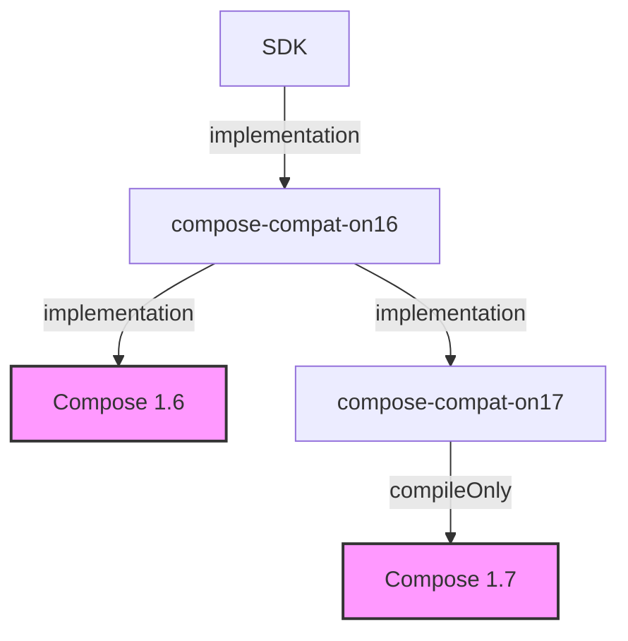

# Unbreaking the changes in Compose 1.7

Compose 1.7 brings a few improvements, most notably performance benefits. Updating seems like a no-brainer - but unfortunately it's not always that easy!

## Updating to Compose 1.7: Who moves first?

Say we're working on an internal SDK integrated into various apps. Updating to Compose 1.7 poses an interesting challenge: Who moves first?

In the beginning I believed it doesn't matter. After opening our `libs.versions.toml` and bumping Compose to 1.7... we see build errors?

It turns out that even though Compose 1.7 technically is only a minor version bump, in practice there are **breaking changes**.
In particular, this internal SDK uses many APIs that are marked as experimental in Compose 1.6.
Google grants itself the liberty to change these APIs as they evolve. Unfortunately they do so **without a deprecation cycle**.

This would be fine if experimental APIs were easy to avoid in Compose. [This is not the case.](https://github.com/search?q=%40OptIn%28Experimentalfoundationapi%3A%3Aclass%29&type=code)

This includes innocuous-looking APIs like `ModalBottomSheet`. It used to have a parameter `windowInsets: WindowInsets` that has changed to `contentWindowInsets: @Composable () -> WindowInsets` - a breaking change!

This is what the API looked like before:

```kotlin
@Composable
@ExperimentalMaterial3Api
fun ModalBottomSheet(
    // ...
    windowInsets: WindowInsets = BottomSheetDefaults.windowInsets,
) {
    // ...
}
```

And this is what it looks like in the Compose 1.7 artifacts:

```kotlin
@Composable
@ExperimentalMaterial3Api
fun ModalBottomSheet(
    // ...
    contentWindowInsets: @Composable () -> WindowInsets = { BottomSheetDefaults.windowInsets },
) {
    // ...
}
```

This is a problem. Let's assume both the internal SDK as well as the host app use the `ModalBottomSheet` component.
Who should update to Compose 1.7 first?

### Idea 1: The SDK updates first

If the internal SDK updates to Compose 1.7 first, this causes a transitive dependency for the host app to Compose 1.7 as well.
As the app is still using the Compose 1.6-version of `ModalBottomSheet`, the app's call to this composable is now broken, forcing
the app's development team to immediately work on restoring Compose 1.7 compatibility. As an SDK developer, this is not a situation I want to put an app developer in.

### Idea 2: Wait for the host apps to update

Unfortunately we also can't just wait for the host app to upgrade to Compose 1.7. As there can only be a single Compose version on the classpath,
the moment the app depends on Compose 1.7, our SDK would cause runtime crashes as it is trying to call Compose 1.6-APIs that are no longer available
or changed in Compose 1.7.

Using a naive approach, all internal and external modules using experimental Compose APIs of an app have to move to Compose 1.7 at the same time.
In many organizations, this is not desirable.

## The way out

Not updating is not an option - so how can we escape from this trap?

As an Android developer, the solution is actually right before our eyes. For calling Android framework APIs, the
Android SDK itself offers a way to call different APIs depending on the system version the app is running on. Code like the following is a frequent sight:

```kotlin
 val color = if (Build.VERSION.SDK_INT >= Build.VERSION_CODES.M) {
    resources.getColor(R.color.colorPrimary, null)
} else {
    resources.getColor(R.color.colorPrimary)
}
```

What if we could do the same for Compose APIs?

The solution is a compatibility layer that calls Compose 1.6 APIs when Compose 1.6 is on the classpath
and Compose 1.7 APIs when Compose 1.7 is on the classpath. Let's get started:

```kotlin
@Composable
fun ModalBottomSheetCompat(
    contentWindowInsets: @Composable () -> WindowInsets = { BottomSheetDefaults.windowInsets },
    // ...
) {
    if (runningOnCompose16) {
        androidx.compose.material3.ModalBottomSheet(
            windowInsets = contentWindowInsets(),
            // ...
        )
    } else {
        // We're on Compose 1.7 or higher
        androidx.compose.material3.ModalBottomSheet(
            contentWindowInsets = contentWindowInsets,
            // ...
        )
    }
}
```

Maybe you've already noticed: This snippet can't actually be compiled. To not force the app to Compose 1.7 through a transitive dependency,
the internal SDK has to declare a dependency to Compose 1.6. However, Compose 1.6 does not have an overload of
`ModalBottomSheet` with a `contentWindowInsets` parameter, so the function call cannot be resolved by the compiler.

### Setting up the Gradle module structure for our Compose Compatibility Layer

Remember, the goal is to build a compatibility layer offering an API callable from Compose 1.6 *and* Compose 1.7 environments. This requires creating two Gradle modules: `compose-compat-on16` and `compose-compat-on17`.

<div id="diagram">

<style type="text/css">
#diagram img {
    max-height: 30em;
    margin: 0 auto;
    display: block;
}
</style>



</div>

The `compose-compat-on16` module defines the API of our compatibility layer. To keep the structure simple,
it also has an `implementation` dependency to Compose 1.6 and calls its APIs directly within a Compose 1.6 environment.

When `compose-compat-on16` detects that it's running within a Compose 1.7 environment, it delegates to the `compose-compat-on17` module.
To call Compose 1.7 APIs (without resorting to Reflection), `compose-compat-on17` must depend on Compose 1.7.
This has to be a `compileOnly` dependency, ensuring that no transitive dependency to Compose 1.7 exists for the host app.

Let's take a look at the code.

#### `compose-compat-on16`

**build.gradle.kts**
```kotlin
plugins {
    // ...
}

android {
    // ...
}

dependencies {
    implementation(project(":compose-compat-on17"))
    implementation("androidx.compose.material3:material3:1.2.1") // Compose 1.6
}
```

**ModalBottomSheetCompat.kt**
```kotlin
package composecompaton16

@Composable
@ExperimentalMaterial3Api
fun ModalBottomSheetCompat(
    contentWindowInsets: @Composable () -> WindowInsets = { BottomSheetDefaults.windowInsets },
    // ...
) {
    if (runningOnCompose16) {
        androidx.compose.material3.ModalBottomSheet(
            // Obtain WindowInsets by just calling contentWindowInsets for its return value
            windowInsets = contentWindowInsets(),
            // ...
        )
    } else {
        // We're on Compose 1.7 or higher -> Delegate to the compose-compat-on17 module
        composecompaton17.ModalBottomSheetCompat(
            contentWindowInsets = contentWindowInsets,
            // ...
        )
    }
}
```

#### `compose-compat-on17`

**build.gradle.kts**
```kotlin
plugins {
    // ...
}

android {
    // ...
}

dependencies {
    compileOnly("androidx.compose.material3:material3:1.3.0") // Compose 1.7
}
```

**ModalBottomSheetCompat.kt**
```kotlin
package composecompaton17

@Composable
@ExperimentalMaterial3Api
fun ModalBottomSheetCompat(
    contentWindowInsets: @Composable () -> WindowInsets = { BottomSheetDefaults.windowInsets },
    // ...
) {
    // In this module the call resolves successfully!
    androidx.compose.material3.ModalBottomSheet(
        contentWindowInsets = contentWindowInsets(),
        // ...
    )
}
```

### The last piece of the puzzle

If you copy and paste the code snippets above, you'll quickly notice that we haven't defined the value `runningOnCompose16` yet.

Unfortunately the myriad of Compose libraries don't offer an easy and consistent way to detect their version _at runtime_. Let's build our own then!

#### `compose-compat-on17`

**VersionCheck.kt**

```kotlin
package composecompaton17

val runningOnCompose16: Boolean =
    try {
        androidx.compose.material3.ripple(color = Color.Red)
        false
    } catch (e: LinkageError) {
        true
    }
```

The `ripple` function has been added in the Compose 1.7 version of the Material3 library. We try to call it.
If the function does not actually exist at runtime, an error is thrown.
We can catch it and derive that we're running in a Compose 1.6 environment.

Goal achieved! Now we just need to import this value inside `compose-compat-on16`'s `ModalBottomSheetCompat.kt`.

# Wrapping up

We've now successfully implemented a `ModalBottomSheetCompat` component that can be called safely from our SDK code.
It can be run in a Compose 1.6 environment as well as a Compose 1.7 environment, all without forcing the host app
to update to Compose 1.7 itself.

We just add a dependency from our SDK module to our compatibility module:

**sdk/build.gradle.kts**
```kotlin
dependencies {
    implementation(project(":compose-compat-on16"))
    // Other Compose 1.6 dependencies here
}
```

And now we can use out compatibility function:

**sdk/src/main/kotlin/MyAwesomeSdkFeature.kt**
```kotlin
@Composable
@OptIn(ExperimentalMaterial3Api::class)
fun MyAwesomeSdkFeature() {
    ModalBottomSheetCompat(
        contentWindowInsets = { /* ... */ }
    )
}
```

For an easy overview, I've published the snippets above as a [GitHub Gist](https://gist.github.com/cbruegg/e954313c92c7fa835fe1c2ad70699876).
You may have to apply small fixes such as adding missing imports.

# A plea to Google

Marking experimental APIs as such makes a lot of sense - and so does letting their API evolve more radically.
Developers using them should be aware that they may need to react fast to changes.
However, using and generating feedback for experimental APIs in real applications and libraries is only possible when developers are given the _chance_ to react to changes.

As this blog post shows, breaking ABI changes in a minor version bump make this challenging.
That doesn't mean experimental APIs need to be maintained forever - but maybe just drop them one release later.

# Bonus Content

## Version checks for other artifacts

Not only the Material3 library has seen breaking changes. In fact, even the `androidx.compose.foundation` module has breaking changes.
If your code is affected by breaking changes in more than one Compose module, you have to define multiple `runningOnCompose16` values.

For example, you can detect the version of the foundation module by placing this check in `compose-compat-on16`:

```kotlin
@OptIn(ExperimentalFoundationApi::class)
val isFoundationCompose16: Boolean =
    try {
        AnchoredDraggableState(
            initialValue = Unit,
            positionalThreshold = { it },
            velocityThreshold = { 0f },
            animationSpec = SnapSpec(),
        )
        true
    } catch (e: LinkageError) {
        false
    }
```

## Preventing usage of changed APIs

As our internal SDK still depends on Compose 1.6, it is possible to accidentally call APIs that were broken with the update to Compose 1.7.
To prevent this, we can learn from Tor Norbye's excellent talk on how to [_Write your own Kotlin lint checks_](https://www.youtube.com/watch?v=q5q-y3eZTSA).

For example, we can ban direct calls to `ModalBottomSheet` by creating a Gradle module called `custom-lint-checks`:

**build.gradle.kts**
```kotlin
plugins {
    id("kotlin")
}

dependencies {
    compileOnly("com.android.tools.lint:lint-api:31.7.1")
}

tasks.withType<Jar> {
    manifest {
        attributes("Lint-Registry-v2" to "com.example.Registry")
    }
}
```

**Registry.kt**
```kotlin
package com.example

class Registry : IssueRegistry() {
    override val issues: List<Issue> = listOf(Compose16UsageDetector.ISSUE)

    override val api: Int = CURRENT_API

    override val minApi: Int = CURRENT_API

    override val vendor = Vendor(
        vendorName = "...",
        contact = "...",
    )
}
```

**Compose16UsageDetector.kt**
```kotlin
class Compose16UsageDetector :
    Detector(),
    SourceCodeScanner {

    companion object Issues {
        val ISSUE = Issue.create(
            id = "Compose16Usage",
            briefDescription = "Disallow use of Compose APIs that have been changed in Compose 1.7",
            explanation = "...",
            category = Category.CORRECTNESS,
            severity = Severity.FATAL,
            implementation = Implementation(
                Compose16UsageDetector::class.java,
                Scope.JAVA_FILE_SCOPE,
            ),
        )
    }

    override fun getApplicableMethodNames() = listOf("ModalBottomSheet")

    override fun visitMethodCall(context: JavaContext, node: UCallExpression, method: PsiMethod) {
        val cls = method.containingClass?.qualifiedName ?: return
        val fn = node.methodName
        if (cls.startsWith("androidx.compose.material3.ModalBottomSheet") && fn == "ModalBottomSheet") {
            // startsWith as in Compose 1.6 the actual containing class file is ModalBottomSheet_androidKt (KMP convention)
            val message = "API changed in Compose 1.7. This call will crash in apps using Compose 1.7!"
            context.report(
                issue = ISSUE,
                scope = node,
                location = context.getLocation(node),
                message = message,
            )
        }
    }
}
```

In our SDK module, we can now add this lint check module to let Android Studio and Gradle's `lint` task pick up the rule:

```kotlin
dependencies {
    lintChecks(project(":custom-lint-checks"))
    // ...
}
```
